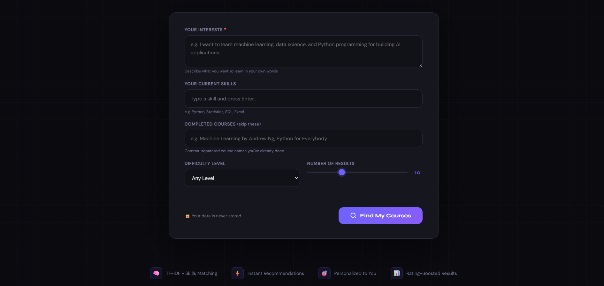
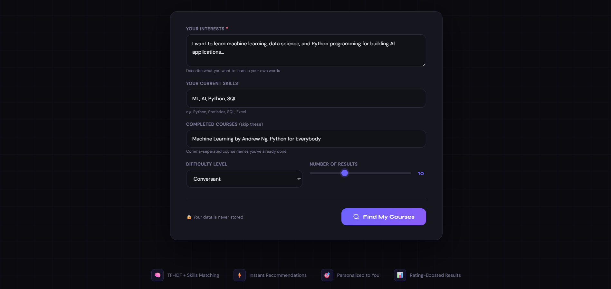
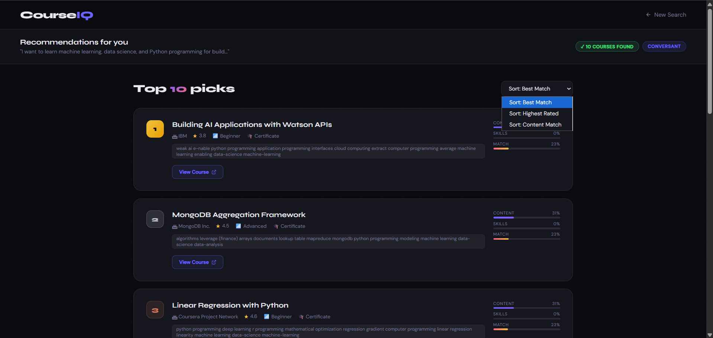
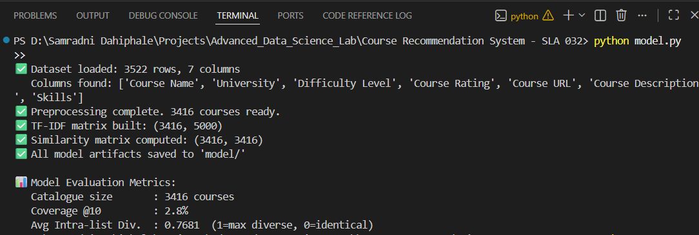

# CourseIQ - Course Recommendation System

### Built with Flask | Content-Based Filtering + Skills Matching | Coursera Dataset 2021

> **CourseIQ**  
> A personalized course recommendation engine that suggests online courses based on a student's interests, skills, and completed courses.

---

## Project Overview

CourseIQ helps learners discover relevant Coursera courses using:

- TF-IDF based content matching on course titles, descriptions, and skills
- Jaccard similarity for user-skill overlap
- Difficulty filtering
- Completed-course exclusion
- Rating-aware ranking

---

## Project Structure

```text
Course Recommendation System - SLA 032/
|-- app.py
|-- recommender.py
|-- model.py
|-- preprocessing.py
|-- requirements.txt
|-- README.md
|-- Course Recommendation System Report.docx
|-- image1.png
|-- image2.png
|-- image3.png
|-- image4.png
|-- image5.png
|-- data/
|   |-- coursera_courses.csv
|   `-- coursera_courses.zip
|-- model/
|   |-- courses_df.pkl
|   |-- similarity_matrix.pkl
|   |-- tfidf_matrix.pkl
|   `-- vectorizer.pkl
`-- templates/
    |-- index.html
    `-- results.html
```

---

## Dataset

**Dataset used:** [Coursera Courses Dataset 2021](https://www.kaggle.com/datasets/khusheekapoor/coursera-courses-dataset-2021)

| Property | Detail |
|---|---|
| Source | Kaggle |
| Total usable courses | 3,416 |
| Core fields | Course Name, Description, Skills, Difficulty, Rating, Certificate Type |
| Why selected | Supports both content-based matching and skills-based ranking |

Place the dataset CSV inside `data/coursera_courses.csv` before building the model from scratch.

---

## Preprocessing And Features

All preprocessing logic is implemented in `preprocessing.py`.

Main steps:

- Normalize column names
- Handle missing values
- Remove duplicates
- Clean and lemmatize text
- Parse skills into structured lists
- Build a weighted `combined_features` field

```text
combined_features = course_name x 2
                  + course_description
                  + skills x 2
```

This weighting helps the model emphasize course titles and skill tags more than generic description text.

---

## Model Design

The recommender combines content similarity and skill overlap:

```text
User Input
   |
   v
TF-IDF vectorization on combined_features
   |
   v
Cosine similarity -> Content score (0.6)
   |
   v
Jaccard overlap -> Skills score (0.4)
   |
   v
Final score + small rating bonus
   |
   v
Top-N ranked recommendations
```

### TF-IDF settings

| Parameter | Value |
|---|---|
| Max Features | 5000 |
| N-gram Range | (1, 2) |
| Min DF | 1 |
| Max DF | 0.95 |
| TF Scaling | Sublinear |

### Evaluation metrics used

- Catalogue size
- Coverage@10
- Average intra-list diversity

---

## Project Working

### 1. Landing page


### 2. Recommendation form



### 3. Filled user input example



### 4. Recommendation results



### 5. Model build and evaluation output



---

## Sample Input

| Input Field | Example Value |
|---|---|
| Interests | I want to learn machine learning and AI to build intelligent models |
| Skills | Python, Statistics |
| Completed Courses | Machine Learning by Andrew Ng |
| Difficulty | Any Level |
| Results | 10 |

---

## Setup And Run

### 1. Install dependencies

```bash
pip install -r requirements.txt
```

### 2. Build the model

```bash
python model.py
```

### 3. Start the Flask app

```bash
python app.py
```

### 4. Open in browser

```text
http://127.0.0.1:5000
```

---

## Available Routes

| Route | Method | Description |
|---|---|---|
| `/` | GET | Home page |
| `/recommend` | POST | Returns ranked recommendations |
| `/similar` | GET | Finds similar courses |
| `/api/recommend` | POST | JSON recommendation API |
| `/evaluate` | GET | Evaluation metrics page |
| `/about` | GET | About page |

---

## Example API Request

```json
{
  "interests": "machine learning and deep learning",
  "skills": ["python", "statistics"],
  "completed_courses": ["Machine Learning by Andrew Ng"],
  "difficulty": "intermediate",
  "top_n": 5
}
```

---

## Dependencies

```txt
flask
pandas
numpy
scikit-learn
nltk
gunicorn
```

---

## Tech Stack

| Layer | Technology |
|---|---|
| Backend | Python, Flask |
| ML / NLP | scikit-learn, NLTK |
| Data | pandas, numpy |
| Frontend | HTML, CSS, JavaScript |
| Dataset | Coursera Courses Dataset 2021 |
| Model storage | Pickle files |

---

## Report

Project report: [Course Recommendation System Report.docx](./Course%20Recommendation%20System%20Report.docx)
