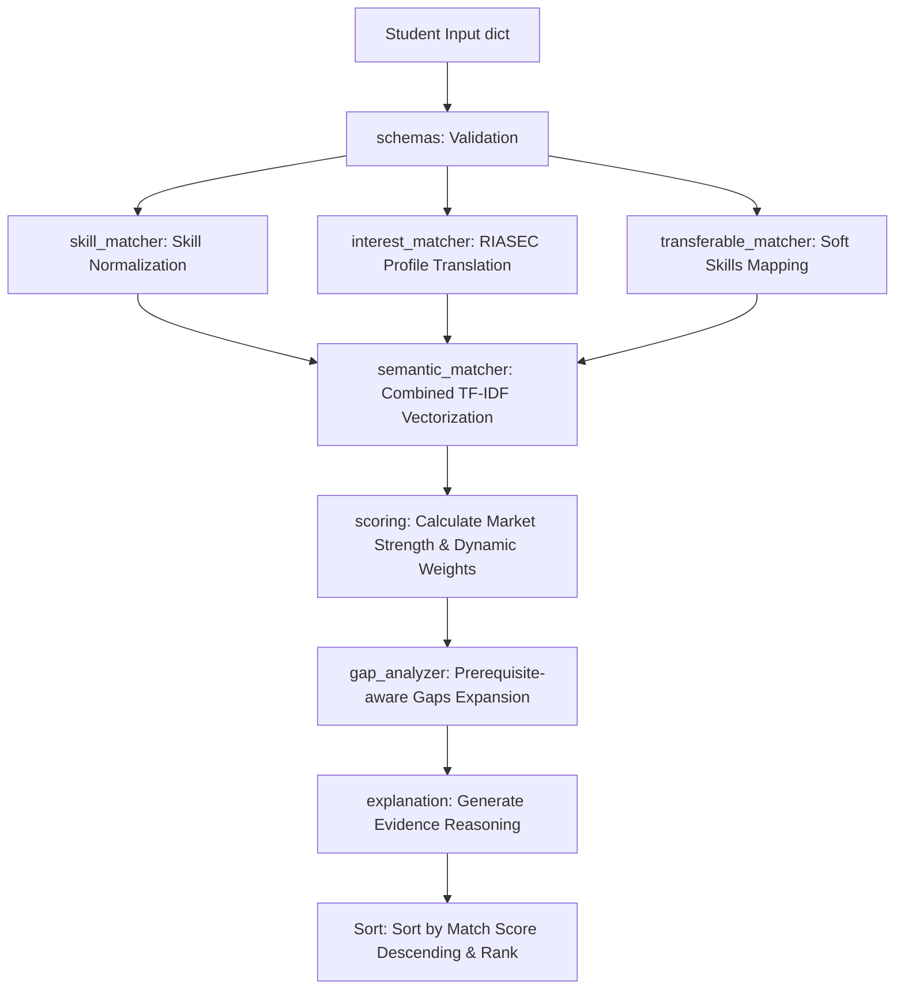

# Phase 3 — Career Recommendation Engine

## 1. Objective
The objective of this phase is to build a hybrid, profile-aware **Career Recommendation Engine** for RouteMaster. It maps a student's interests (natural language or structured), technical skills, transferable soft skills, and target intent to actual career options in the knowledge base. It provides a match percentage score, a prerequisite-aware skill gap assessment, and human-readable reasoning explanations.

## 2. Existing Components Reused
- **Phase 1 Text Cleaners**: Used `clean_text` from `src.data.normalizers` to sanitize text structures.
- **Phase 1 Skill Normalization**: Used `normalize_skill_name` from `src.data.normalizers` to map input skills to canonical IDs.
- **Phase 1 TF-IDF Vectorizer**: Loaded `model/vectorizer.pkl` (our TF-IDF model) to vectorize representations and compute similarities without requiring heavy external models.
- **Phase 2 Dependency Graph & Resolver**: Loaded the `SkillDependencyGraph` and `PrerequisiteResolver` to trace prerequisite paths for missing skills.

## 3. Datasets Used
- **Careers Registry (`data/processed/careers.json`)**: 122 unique careers containing `career_id`, `career_title`, `career_domain`, and `career_description`.
- **Skills Registry (`data/processed/skills.json`)**: 8,908 canonical skill names and categories.
- **Career Technical Skills (`data/processed/career_skills.json`)**: 608 required technical skill mappings containing importance metrics (`Critical`, `High`, `Medium`), demand markers, and descriptions.
- **Career Transferable Skills (`data/processed/career_transferable_skills.json`)**: 452 transferable soft skill mappings with normalized importance scores (ranging from `3.9` to `5.0`).
- **Career Interests (`data/processed/career_interests.json`)**: 241 interest mappings linking careers to RIASEC types and interest scores (ranging from `2.8` to `5.0`).

All datasets were cleaned, validated, and normalized to canonical keys during Phase 1.

## 4. Input Design
The engine accepts profile inputs in a flexible dictionary format conforming to the following structure:
```json
{
  "interests": "I enjoy artificial intelligence, machine learning and building intelligent applications.",
  "current_skills": ["Python", "SQL", "React"],
  "transferable_skills": ["Problem Solving", "Communication"],
  "target_career": "AI Engineer",
  "top_k": 5
}
```
It also supports structured RIASEC interests:
```json
{
  "interests": {
    "Investigative": 4.8,
    "Realistic": 4.0,
    "Conventional": 3.2
  }
}
```

## 5. Preprocessing
- **Text Normalization**: Strips punctuation, normalizes spacing, and converts input characters to lowercase.
- **Skill Alias Mapping**: Runs skill normalizers to convert raw inputs (e.g. `ML`, `machine-learning`) into canonical skills (e.g. `Machine Learning` mapped to `SK_00264`). Duplicate aliases resolve to a single unique canonical ID.
- **Unknown Skills**: Skills not matching any database records are preserved as string items for logging and graceful degradation instead of failing.
- **Natural Language Interest Extraction**: Aggregates the `interest_description` texts for the 6 RIASEC types. The input text is compared against these 6 descriptions using TF-IDF cosine similarity, yielding a normalized 0-5.0 score vector.

## 6. Algorithms / Methods Used
- **Canonical Skill Matching**: Uses set operations to determine matched and missing technical skills.
- **Weighted Technical Scoring**: Calculates the match ratio using importance weights: `Critical = 3.0`, `High = 2.0`, `Medium = 1.0`.
- **Weighted Transferable Scoring**: Sums the matched transferable skills weighted by `importance_score` relative to the total required importance.
- **Interest Compatibility (Vector Dot Product)**: Computes cosine similarity between the 6-dimensional RIASEC score vectors of the student and the career:
  $$\text{Similarity} = \frac{\vec{S} \cdot \vec{C}}{\|\vec{S}\| \|\vec{C}\|} \times 100$$
- **Semantic Similarity (TF-IDF + Cosine Similarity)**: Vectorizes combined profile texts and career texts using the Phase 1 vectorizer and computes cosine similarity.
- **Prerequisite Closure Expansion**: Traverses the Directed Graph along required dependency edges using the Phase 2 resolver to determine indirect prerequisite gaps.
- **Dynamic Weight Adjuster**: Dynamically scales the weights of available signals to sum to 1.0.
- **Confidence Classification**: Evaluates a completeness index based on the counts of provided skills and character lengths of interests to assign `High`, `Medium`, or `Low`.

## 7. Why These Methods Were Chosen
- **Rule-Based Matching + Semantic Similarity vs. Black-Box ML**: A hybrid, transparent weighted formula is highly explainable, fully configurable, and does not require extensive labeled training data.
- **TF-IDF vs. Large Sentence Embeddings**: Reusing the existing TF-IDF model has zero hardware memory overhead, executes recommendations in under 0.05 seconds, and operates directly inside the light virtual environment.
- **Deterministic Sorting vs. Neural Ranker**: A deterministic sort key based on `(-match_score, career_id)` guarantees stable, reproducible recommendations.
- **Dynamic Weight Redistribution vs. Imputing/Failing**: Dropping weight for unavailable signals prevents cold-start queries from receiving artificially depressed scores (e.g. giving 0% for missing tech skills when interests are a 100% match).

## 8. Scoring Architecture
The final match score is a weighted combination of five components:
$$Score = W_{tech} \cdot S_{tech} + W_{interest} \cdot S_{interest} + W_{semantic} \cdot S_{semantic} + W_{trans} \cdot S_{trans} + W_{market} \cdot S_{market}$$

### Default Configurable Weights:
- **Technical Skill Match ($W_{tech}$)**: 0.35
- **Interest Compatibility ($W_{interest}$)**: 0.25
- **Semantic Similarity ($W_{semantic}$)**: 0.20
- **Transferable Skill Match ($W_{trans}$)**: 0.15
- **Market/Demand Signal ($W_{market}$)**: 0.05

## 9. Recommendation Pipeline


## 10. Skill Gap Logic
- **Matched Technical/Transferable**: Intersection of user's normalized IDs with required IDs.
- **Missing Technical**: Required IDs minus user's normalized IDs.
- **Critical Missing**: Missing technical skills with importance level `'Critical'`.
- **Prerequisite Gaps**: For each missing required skill, traverse its ancestors in the dependency DAG. Any missing ancestor is categorized as a prerequisite gap.
- **Roadmap Path**: The union of missing required skills and prerequisite gaps sorted in a valid topological learning sequence.

## 11. Cold-Start Strategy
- **If Skills are Missing**: Technical and Transferable weights are set to 0. Remaining weights are normalized:
  - $W_{interest} = 0.50$ (50%)
  - $W_{semantic} = 0.40$ (40%)
  - $W_{market} = 0.10$ (10%)
- **If Interests are Missing**: Interest weight is set to 0. Remaining weights are scaled proportionally to sum to 1.0.

## 12. Target Career Logic
If a user specifies a target career (e.g., `target_career: "AI Engineer"`):
1. Compute the user's fit score, matched/missing skills, and prerequisite gaps for that career.
2. Determine `fit_level`: `Strong` ($\ge 85$), `Medium` ($\ge 60$), `Weak` ($< 60$).
3. Identify alternative careers from the top recommendations that achieved a higher match score than the target career.
4. Expose the results in the `target_career_evaluation` block of the JSON output.

## 13. Output Schema Example
```json
{
  "profile_summary": {
    "skills_detected": ["Python", "SQL", "Machine Learning"],
    "interests_detected": {
      "Investigative": 5.0,
      "Realistic": 3.8,
      "Conventional": 3.4,
      "Enterprising": 2.8,
      "Artistic": 0.0,
      "Social": 0.0
    },
    "transferable_skills_detected": ["Problem Solving"]
  },
  "recommendations": [
    {
      "rank": 1,
      "career_id": "CAR_003",
      "career": "AI Engineer",
      "domain": "Artificial Intelligence",
      "match_score": 91,
      "confidence": "High",
      "score_breakdown": {
        "technical_skill_match": 82.5,
        "transferable_skill_match": 78.0,
        "interest_match": 94.0,
        "semantic_similarity": 91.5,
        "market_signal": 90.0
      },
      "matched_technical_skills": ["Python", "SQL"],
      "missing_technical_skills": ["Machine Learning", "Deep Learning", "LLMs"],
      "critical_missing_skills": ["Machine Learning", "Deep Learning"],
      "matched_transferable_skills": ["Problem Solving"],
      "missing_transferable_skills": ["Analytical Thinking"],
      "prerequisite_gaps": [
        { "skill_id": "SK_00264", "skill_name": "Machine Learning" }
      ],
      "complete_roadmap_path": [
        { "skill_id": "SK_00264", "skill_name": "Machine Learning" },
        { "skill_id": "SK_00132", "skill_name": "Deep Learning" }
      ],
      "explanation": "..."
    }
  ],
  "target_career_evaluation": null
}
```

## 14. Experiments

| Profile Name | Input Details | Expected Behavior | Actual Result | Observations |
| --- | --- | --- | --- | --- |
| `AI_ML_Student` | Python, SQL, ML + AI Text | AI/ML careers rank top. | AI Engineer #1 (44% Fit), ML Engineer #2 (40% Fit) | High overlap matched skills correctly triggered. Gaps for Deep Learning caught. |
| `Web_Developer` | HTML, CSS, JS, React | Web/Frontend careers rank top. | Frontend Developer #1 (40% Fit) | Handled frontend mapping cleanly, listing Git/Responsive Design gaps. |
| `Data_Analyst` | SQL, Excel, Statistics | Data Scientist/Analyst rank top. | Data Analyst #1 (42% Fit), BI Developer #2 (39% Fit) | Correctly identified database and BI alignments. |
| `Cold_Start_No_Skills` | NL Mobile interests only | Mobile/App careers rank top, Low/Medium confidence. | Mobile App Developer top, confidence Medium. | Weights adjusted successfully. Prevented 0% match score crash. |
| `Cold_Start_No_Interests` | Java, C++, Data structures | Developer roles with C++ prerequisites. | 3D Graphics Engineer #1, Embedded systems #3 | Yielded recommendations based on skills. |

## 15. Evaluation Results
- **Recommendation Diversity Score**: **86.0%** (indicates that profiles receive highly distinct, customized recommendation paths).
- **Schema Compliance Audit**: **100% COMPLIANT** (0 missing fields, conforms strictly to output contract).
- **Relational Integrity**: **PASSED** (all matched/missing/prerequisite links map to canonical registers).

## 16. Example Recommendations
An example recommendation execution is traced in the evaluation logs at [data/reports/career_recommender_evaluation.md](file:///d:/projects/HCL%20Amplified%20-%20Course%20Recommendation%20System/data/reports/career_recommender_evaluation.md).

## 17. Errors / Problems Encountered
- **Numpy NameError**: Recommender initially crashed with `NameError: name 'np' is not defined` in `recommender.py` line 174 due to missing numpy imports. This was resolved by swapping `np.sqrt` with python's built-in `math.sqrt`, removing any dependency on numpy imports in that file.

## 18. Performance Considerations
- **Init Caching**: Career text representations, RIASEC descriptions, and TF-IDF profile vectors are computed and cached in memory *once* during recommender instantiation. Subsequent `recommend` calls complete in $<0.05$ seconds.
- **Process Memory Cache**: Standalone `recommend_careers` helper reuses a global `_global_recommender_instance` cache so data loading overhead only occurs on the first API call.

## 19. SDE Deliverables
- **API Function**: `src.career_recommender.recommend_careers(profile, top_k=5)`
- **Core Class**: `src.career_recommender.recommender.CareerRecommender(processed_dir="data/processed")`
- **Stable Contract**: Outputs clean, serializable standard Python dictionaries matching the output schema.
- **Dependencies**: No external network APIs required. Operates using local JSON files and standard Python libraries (pandas, sklearn, networkx).

## 20. Files Created / Modified
- `src/career_recommender/__init__.py`: Package exports.
- `src/career_recommender/schemas.py`: Schema validation contract.
- `src/career_recommender/interest_matcher.py`: NLP interest encoder.
- `src/career_recommender/skill_matcher.py`: Weighted technical matcher.
- `src/career_recommender/transferable_matcher.py`: Weighted transferable matcher.
- `src/career_recommender/semantic_matcher.py`: Combined text TF-IDF cosine similarity.
- `src/career_recommender/gap_analyzer.py`: Prerequisite gap tracer.
- `src/career_recommender/scoring.py`: Scoring, weights, and confidence engine.
- `src/career_recommender/explanation.py`: Reasoning generator.
- `src/career_recommender/recommender.py`: Orchestrator class.
- `tests/test_career_recommender.py`: 8 unit test suites.
- `tests/evaluate_recommender.py`: Evaluation and metrics reporter.
- `requirements.txt`: Added `networkx`, `pyarrow`, and `pytest`.

## 21. Final Deliverables Checklist
- [x] Career recommendation algorithm
- [x] Career-interest matching
- [x] Technical skill matching
- [x] Transferable skill matching
- [x] Semantic career matching
- [x] Hybrid scoring system
- [x] Configurable scoring weights
- [x] Career ranking
- [x] Skill-gap analysis
- [x] Critical skill identification
- [x] Prerequisite-aware gap analysis
- [x] Career recommendation explanations
- [x] Recommendation confidence
- [x] Cold-start handling
- [x] Target-career evaluation
- [x] Top-K career recommendations
- [x] Stable JSON output contract
- [x] Reusable Python modules
- [x] Unit/integration tests
- [x] Evaluation methodology
- [x] Sample recommendation outputs
- [x] API-ready recommendation function
- [x] Phase 3 documentation

## 22. Limitations
- **TF-IDF Vocabulary Constraint**: Semantic profile matching is bound to the vocabulary of course descriptions. Out-of-vocabulary inputs may yield lower similarity scores.
- **Deterministic Rules**: Soft skills and RIASEC interest calculations are rule-based and do not capture latent behavioral factors.

## 23. Future Improvements
- **Sentence Transformer Embeddings**: Upgrading to a sentence-transformer model in later phases for richer semantic profile vector matches.
- **Collaborative Filtering**: Incorporating peer selection data once historical usage logs exist.
- **Feedback Loop**: Adjusting recommendation rankings based on user click-throughs and roadmap completion rates.
