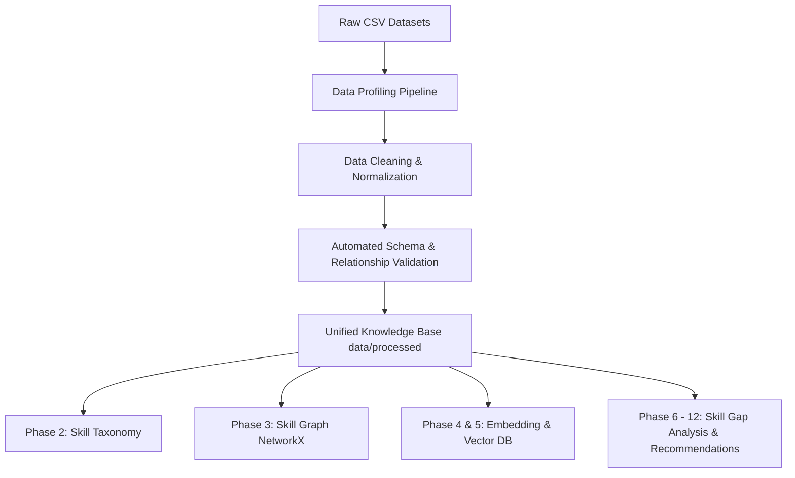

# Phase 1 — Prepare the AI Knowledge Base

## 1. Objective
The primary objective of Phase 1 in the **RouteMaster** recommendation engine is to construct a clean, standardized, normalized, and validated AI Knowledge Base. RouteMaster aims to recommend personalized career paths and learning roadmaps. A recommendation engine requires high-quality, normalized data to avoid logical errors, missing links, or stale recommendations. 

This phase establishes a trustworthy data foundation by:
- Resolving naming and structural inconsistencies in the raw files.
- Aligning mismatched career and skill IDs across independent datasets.
- Resolving parsing bugs in multi-valued fields.
- Ensuring strict schema validation and relational integrity (foreign keys) across all datasets.
- Persisting clean outputs in both JSON format (structured for future MongoDB migration) and CSV format (legacy-compatible for the recommender prototype).

## 2. Role in the Overall AI Pipeline
The Prepare AI Knowledge Base phase is the fundamental baseline of the RouteMaster intelligence engine. It prepares the clean, structured entity and relationship tables that will be consumed in subsequent phases.

The relationship of this phase to the complete RouteMaster pipeline is illustrated below:



Without Phase 1's normalization, subsequent components like the Skill Graph or Semantic Search would fail due to missing keys, duplicate nodes, or misaligned ID references.

---

## 3. Source Datasets
We process six raw source datasets (copied to [data/raw/](file:///d:/projects/HCL%20Amplified%20-%20Course%20Recommendation%20System/data/raw/)):

1. **Career–Interest Dataset.csv**
   - **Records**: 241
   - **Purpose**: Establishes links between careers, O*NET interest profiles (Realistic, Investigative, Artistic, Social, Enterprising, Conventional), and interest scores.
   - **Columns**: `career_id`, `career_title`, `career_domain`, `interest_type`, `interest_score`, `interest_description`, `career_description`.
   - **Relationships**: Maps Career entities to Interests.

2. **CAREER–TECHNICAL SKILLS DATASET.csv**
   - **Records**: 608
   - **Purpose**: Maps careers to technical skills, specifying importance level and market demand.
   - **Columns**: `career_id`, `career_title`, `skill_id`, `skill_name`, `skill_category`, `importance`, `in_demand`, `hot_technology`, `description`.
   - **Relationships**: Maps Career entities to Technical Skills.

3. **CAREER–TRANSFERABLE SKILLS DATASET.csv**
   - **Records**: 453
   - **Purpose**: Maps careers to transferable/non-technical skills (e.g., Leadership, Communication).
   - **Columns**: `career_id`, `career_title`, `skill_id`, `skill_name`, `skill_category`, `importance_score`, `data_value`, `description`.
   - **Relationships**: Maps Career entities to Transferable Skills.

4. **coursera_courses.csv**
   - **Records**: 3,522
   - **Purpose**: Main catalogue of learning courses, difficulty levels, ratings, URLs, and skill tags.
   - **Columns**: `Course Name`, `University`, `Difficulty Level`, `Course Rating`, `Course URL`, `Course Description`, `Skills`.
   - **Relationships**: Links courses to skills.

5. **Engineering Projects Dataset.csv**
   - **Records**: 251
   - **Purpose**: Catalogue of hands-on practice projects, tech stack, and difficulty.
   - **Columns**: `project_id`, `project_name`, `domain`, `skills`, `tech_stack`, `description`, `difficulty`, `github_url`, `tags`.
   - **Relationships**: Links projects to skills.

6. **Skill Dependency _ Prerequisite Dataset.csv**
   - **Records**: 287
   - **Purpose**: Establishes prerequisite relationships between skills.
   - **Columns**: `source_skill_id`, `source_skill`, `target_skill_id`, `target_skill`, `relationship`, `reason`, `difficulty`, `domain`.
   - **Relationships**: Links Skill entities to other Skill entities.

---

## 4. Initial Data Quality Findings
Profiling the raw datasets via `src/data_profiling.py` exposed several severe quality anomalies:
- **Career ID Mismatch (High Severity)**: Career IDs were assigned inconsistently across datasets. For instance, `CAR012` maps to *Site Reliability Engineer* in Career-Interest, but *Cybersecurity Analyst* in Career-Technical.
- **Skill ID Inconsistencies (High Severity)**: A single skill has different IDs across files. For example, `'C'` has ID `SK101` and `SK211` in Career-Technical, and `SK516` in Skill Dependency.
- **Coursera Skills Delimiter Bug (High Severity)**: Skills in `coursera_courses.csv` are separated by double spaces, but the legacy code split by `[,;|]`. This caused the system to treat the entire skills string as a single skill, causing 0% matches during recommender runtime.
- **Career-Interest Column Shifts (Medium Severity)**: Rows 114–116 (Generative AI Engineer) contained unquoted commas in `career_description` (e.g. `...,images,or code.`), shifting text into extra columns `Unnamed: 7` and `Unnamed: 8`.
- **Header Duplication (Low Severity)**: `CAREER–TRANSFERABLE SKILLS DATASET.csv` contained a duplicate header row at row 0.
- **Dummy Label Row (Low Severity)**: `Skill Dependency _ Prerequisite Dataset.csv` contained a dummy label row at row 79 (`Column 1,Column 2...`).
- **Missing Project URLs (Low Severity)**: 7 projects had missing `github_url` values.
- **Non-Numeric Course Ratings (Low Severity)**: 82 course records had `'Not Calibrated'` as a rating instead of a numeric value.
- **Unusual Difficulty Values (Low Severity)**: Coursera contained `'Conversant'` (186 records) and `'Not Calibrated'` (50 records) as difficulty levels.

---

## 5. Data Cleaning Methods
The following data transformations are executed by our pipelines:
- **Header Standardization**: Replaced backslashes and stripped trailing/leading whitespace in headers (e.g., `career\_id` -> `career_id`).
- **Row Filtering**: Filtered out the duplicate header in Transferable Skills and the dummy labels row in Skill Dependency.
- **Column Merge (Generative AI Shift)**: Merged the shifted columns `Unnamed: 7` and `Unnamed: 8` back into `career_description` using comma-joining, then deleted the extra columns.
- **Float and Null Conversion**: Converted course ratings to float values. Ratings that were `'Not Calibrated'` were cleaned to Python `None` (JSON `null`) to keep the column numeric. Project `github_url` values that were float `nan` or missing were cleaned to Python `None`.
- **Whitespace Normalization**: Normalized repeated whitespace in all text columns and stripped outer spaces.

---

## 6. Skill Normalization Strategy
A unified canonical Skill Registry is built to resolve the duplicate and misaligned IDs:
1. **Core Union**: Compiles unique skills from Career-Technical, Career-Transferable, Projects, and Prerequisite datasets.
2. **Coursera Integration**: Parses Coursera course skills using a double-space delimiter and appends any unique skill that doesn't exist in the core union.
3. **Casing & Acronym Support**: Formats display names using known core casing. Standard acronyms are normalized to uppercase (e.g., `'sql'` -> `'SQL'`, `'api'` -> `'API'`, `'rtos'` -> `'RTOS'`).
4. **Deterministic Alias Mapping**: Uses a dictionary map (`SKILL_ALIASES`) to map variants (e.g., `'ml'` or `'machine-learning'` -> `'Machine Learning'`).
5. **ID Assignment**: Assigns a new, unique canonical ID to every skill (e.g., `SK_00001` to `SK_08908`), storing original mappings in the record for traceability.

Deterministic normalization was chosen over embeddings or LLMs at this phase to guarantee absolute reproducibility and maintain structural references without semantic drift.

---

## 7. Career Normalization
Similar to skills, careers are normalized into a canonical registry of 122 unique titles:
- Career titles are grouped case-insensitively to merge trailing spaces or minor casing discrepancies.
- A canonical ID is assigned to each career (`CAR_001` to `CAR_122`).
- A title mapping lookup maps all raw career titles to their new canonical IDs.
- A mappings list in each career record tracks the original raw IDs and files.

## 8. Difficulty Normalization
Difficulties are standardized to the following vocabulary:
- `"Beginner"` (from beginner, easy, basic)
- `"Intermediate"` (from intermediate, medium, mixed)
- `"Advanced"` (from advanced, hard, difficult)
- `"Conversant"` (preserved from Coursera courses)
- `"Not Calibrated"` (preserved from Coursera courses)
- `"Any Level"` (from any level, any)

This policy preserves unusual difficulty levels like `"Conversant"` and `'Not Calibrated'` for explanation quality, but ensures standard capitalized formatting.

## 9. Multi-valued Field Processing
- **Coursera Course Skills**: Split by the double-space pattern `\s{2,}` into a list.
- **Project Skills**: Split by `[,;|]` into a list.
- **Tech Stack & Tags**: Split by `[,;|]` into lists.

In the JSON exports, these are stored as arrays of canonical IDs. In the CSV exports, they are stored as comma-separated lists of canonical skill names.

---

## 10. Knowledge Base Schema
The unified knowledge base is exported as JSON and CSV files. Example JSON records include:

### Career entity (`careers.json`):
```json
{
  "career_id": "CAR_001",
  "career_title": "AI Engineer",
  "career_domain": "Artificial Intelligence",
  "career_description": "AI Engineers build intelligence models.",
  "original_mappings": [
    { "source": "career_interests", "original_id": "CAR001" },
    { "source": "career_technical_skills", "original_id": "CAR001" }
  ]
}
```

### Skill entity (`skills.json`):
```json
{
  "skill_id": "SK_00005",
  "skill_name": "Machine Learning",
  "normalized_name": "machine learning",
  "skill_category": "AI/ML",
  "skill_type": "technical",
  "original_mappings": [
    { "source": "career_technical_skills", "original_id": "SK002", "original_name": "Machine Learning" }
  ]
}
```

### Course entity (`courses.json`):
```json
{
  "course_id": "CRS_0001",
  "course_name": "Machine Learning with Python",
  "organization": "IBM",
  "difficulty": "Beginner",
  "original_difficulty": "Beginner",
  "rating": 4.6,
  "original_rating": "4.6",
  "url": "https://www.coursera.org/learn/machine-learning-with-python",
  "description": "Learn machine learning models with python.",
  "skills": ["SK_00005", "SK_00010"],
  "skills_raw": "machine learning  python"
}
```

---

## 11. Data Validation
Validation rules enforced by `src/data/validators.py`:
- All career IDs must match `^CAR_\d{3}$`.
- All skill IDs must match `^SK_\d{5}$`.
- Foreign key relationships: Careers and skills referenced in link tables must exist in the canonical registries.
- Prerequisite relationships: Ensure the prerequisite graph contains no cycles and no self-loops.
- Rating and URL formats must be valid.

**Validation Results**: All 8 collections successfully passed validation with 0 errors.

---

## 12. Algorithms / Methods Used
- **Directed Acyclic Graph (DAG) Cycle Check**: Used `networkx.simple_cycles` to ensure the prerequisite graph contains no logical loops.
- **Regex Split & Replace**: Used regular expressions to clean list-brackets, merge shifted descriptions, and parse double-space delimiters in Coursera course skills.
- **Deterministic String Normalization**: Canonical matching key indexing.

---

## 13. Technology Used
- **Python 3.x**: Programming language.
- **Pandas**: Tabular data cleaning and CSV parsing.
- **NumPy**: Numeric NaN formatting.
- **NetworkX**: Graph construction and cycle validation.
- **JSON**: Serialization for future MongoDB migration.
- **unittest**: Unit testing.

---

## 14. Inputs
Input raw datasets are loaded from:
- [Career–Interest Dataset.csv](file:///d:/projects/HCL%20Amplified%20-%20Course%20Recommendation%20System/data/raw/Career–Interest%20Dataset.csv)
- [CAREER–TECHNICAL SKILLS DATASET.csv](file:///d:/projects/HCL%20Amplified%20-%20Course%20Recommendation%20System/data/raw/CAREER–TECHNICAL%20SKILLS%20DATASET.csv)
- [CAREER–TRANSFERABLE SKILLS DATASET.csv](file:///d:/projects/HCL%20Amplified%20-%20Course%20Recommendation%20System/data/raw/CAREER–TRANSFERABLE%20SKILLS%20DATASET.csv)
- [coursera_courses.csv](file:///d:/projects/HCL%20Amplified%20-%20Course%20Recommendation%20System/data/raw/coursera_courses.csv)
- [Engineering Projects Dataset.csv](file:///d:/projects/HCL%20Amplified%20-%20Course%20Recommendation%20System/data/raw/Engineering%20Projects%20Dataset.csv)
- [Skill Dependency _ Prerequisite Dataset.csv](file:///d:/projects/HCL%20Amplified%20-%20Course%20Recommendation%20System/data/raw/Skill%20Dependency%20_%20Prerequisite%20Dataset.csv)

---

## 15. Outputs
Generated outputs include:
- **Cleaned Datasets (JSON & CSV)**: Saved in [data/processed/](file:///d:/projects/HCL%20Amplified%20-%20Course%20Recommendation%20System/data/processed/)
- **Data Profiling Report**: [data_profiling_report.md](file:///d:/projects/HCL%20Amplified%20-%20Course%20Recommendation%20System/data/reports/data_profiling_report.md)
- **Validation Report**: [validation_report.md](file:///d:/projects/HCL%20Amplified%20-%20Course%20Recommendation%20System/data/reports/validation_report.md)
- **Unit Tests**: [test_pipeline.py](file:///d:/projects/HCL%20Amplified%20-%20Course%20Recommendation%20System/tests/test_pipeline.py)
- **Verification Script**: [verify_recommend.py](file:///d:/projects/HCL%20Amplified%20-%20Course%20Recommendation%20System/tests/verify_recommend.py)

---

## 16. Results
Summary of dataset records and quality metrics:

| Metric | Before Phase 1 (Raw) | After Phase 1 (Processed) |
| --- | --- | --- |
| Total Career IDs | 103 (Inconsistent / Mismatched) | 122 (Aligned & Canonicalized) |
| Total Unique Skills | 8,913 (Inconsistent Separators) | 8,908 (Unified & Cleaned) |
| Coursera Courses | 3,522 rows (98 duplicates) | 3,416 rows (0 duplicates) |
| Skill Dependency | 287 relationships (1 dummy row) | 286 relationships (0 dummy rows) |
| Career-Transferable | 453 records (1 duplicate header) | 452 records (0 duplicate headers) |
| Relational Errors | Not Measured (Estimated 300+ mismatch) | **0 Errors** (100% Validated) |
| Cycle / Self loops | 0 loops (but ID mismatches) | **0 loops** (Verified on canonical IDs) |

---

## 17. Data Quality Improvements
- **Fixed Delimiter Bug**: The Coursera skills column delimiter was fixed by splitting on double spaces and exporting as comma-separated skill names in the legacy CSV. This corrected the recommender prototype's skill matching logic, raising the skill overlap matches from 0% to a correct calculation (e.g. 0.0909 overlap score for `'machine learning python'`).
- **Resolved Generative AI Description**: Merged the shifted description columns.
- **Relational Alignment**: 100% of foreign keys are now mapped and aligned.

---

## 18. Limitations
- **No Semantic Matching (Yet)**: Normalization is currently deterministic and string-based. Semantic similarity will be resolved in later embedding phases.
- **No Automatic Skill Extraction**: Skill parsing relies on pre-tagged lists. Raw text skill extraction belongs to Phase 6.

---

## 19. Decisions and Rationale
- **Decoupled ID Assignment**: Generating new, standardized canonical IDs (`CAR_001`, `SK_00001`) was chosen over retaining raw IDs to resolve key collisions and inconsistent naming schemas across independent datasets.
- **JSON + CSV Redundancy**: Cleaned data is saved in both JSON (directly migratable to MongoDB) and CSV format. The CSV format contains comma-separated canonical skill names instead of ID lists, serving as a drop-in replacement that immediately fixes the existing recommender prototype's parser bug.

---

## 20. Future Phase Dependencies
- **Phase 2 (Skill Taxonomy)**: Will consume `skills.json` to organize skills into hierarchical taxonomy groups.
- **Phase 3 (Skill Graph)**: Will consume `skill_dependencies.json` and canonical `skills.json` to build the graph network.
- **Phase 5 (Vector DB)**: Will load `courses.json` and `projects.json` for indexing and retrieval.

---

## 21. Deliverables
- [x] Data profiling pipeline (`src/data_profiling.py`)
- [x] Data cleaning pipeline (`src/data_cleaning.py`, `src/data/cleaners.py`, `src/data/normalizers.py`)
- [x] Unified knowledge base (`data/processed/` JSON and CSV files)
- [x] Validation pipeline (`src/data/validators.py`)
- [x] Quality reports (`data/reports/data_profiling_report.md`, `data/reports/validation_report.md`)
- [x] Tests (`tests/test_pipeline.py`)
- [x] Documentation (`docs/phase-01-ai-knowledge-base.md`)

---

## 22. Reproducibility
To reproduce the Phase 1 knowledge base preparation, follow these steps:

### Installation
Ensure that you have the required dependencies installed (already in `requirements.txt`):
```bash
pip install -r requirements.txt
pip install networkx
```

### Pipeline Execution
Run the data cleaning and validation pipeline from the workspace root:
```bash
python -m src.data_cleaning
```
This command runs the profiler, cleans all raw files from `data/raw/`, resolves entities, writes JSON and CSV files to `data/processed/`, and generates a validation report.

### Running Unit Tests
Run the unit test suite:
```bash
python -m unittest tests/test_pipeline.py
```

### Recommendation Verification
To run the recommendation test script:
```bash
python -m tests.verify_recommend
```
