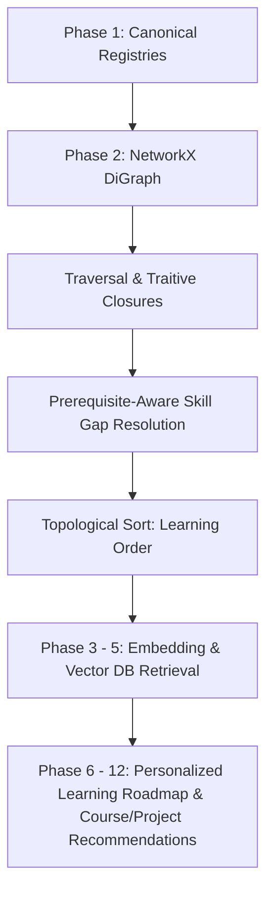

# Phase 2 — Skill Dependency Intelligence

## 1. Phase Objective
The objective of Phase 2 is to transform the cleaned and validated skill and dependency datasets from Phase 1 into a functional directed graph representation. Prerequisite intelligence is essential in **RouteMaster** to:
- Resolve learning order constraints between skills.
- Traverse prerequisite closures so that if a learner wants to study an advanced topic (like LLMs), the engine can identify both immediate (Deep Learning) and transitive (Machine Learning, Python) prerequisites.
- Enable prerequisite-aware skill gap resolution (comparing what a user currently knows against what a target career path requires, including prerequisite expansion).
- Provide explainable reasons for learning sequence recommendations.
- Avoid logically circular path suggestions.

## 2. Position in Overall Architecture
The Skill Dependency Intelligence phase functions as the logical ordering and sequencing engine of RouteMaster. It operates between the raw knowledge base preparation and the retrieval/recommendation stages:



Without the topological sequencing of Phase 2, course and project retrieval would result in fragmented lists with no logical learning progression (e.g. recommending a Deep Learning course before a Python course).

## 3. Input Data
We consume the clean outputs generated in Phase 1:
- `data/processed/skills.json` (canonical skills registry): 8,908 unique skill records.
- `data/processed/skill_dependencies.json` (prerequisite relationships): 286 dependency records.
- `data/processed/career_skills.json` (careers mapped to technical skills): 608 records.
- `data/processed/career_transferable_skills.json` (careers mapped to transferable skills): 452 records.

## 4. Data Model
Nodes represent skills, and edges represent directed dependency relationships.

### Skill Node JSON Example (`skills.json`):
```json
{
  "skill_id": "SK_00360",
  "skill_name": "Python",
  "normalized_name": "python",
  "skill_category": "Programming",
  "skill_type": "technical",
  "original_mappings": [
    { "source": "career_technical_skills", "original_id": "SK001", "original_name": "Python" }
  ]
}
```

### Dependency Edge JSON Example (`skill_dependencies.json`):
```json
{
  "dependency_id": "DEP_001",
  "source_skill_id": "SK_00070",
  "source_skill_name": "C",
  "target_skill_id": "SK_00073",
  "target_skill_name": "C++",
  "relationship": "prerequisite",
  "reason": "C provides the foundational procedural programming concepts required to learn object-oriented C++.",
  "difficulty": "Beginner",
  "domain": "Programming"
}
```

## 5. Graph Architecture
The dependency model is implemented as a **Directed Graph (DiGraph)** in NetworkX.
- **Node representation**: Each node has an ID corresponding to the canonical `skill_id`. Attributes include `canonical_name`, `skill_category`, and `skill_type`.
- **Edge representation**: Directed edges point from the prerequisite skill to the target skill (`source_skill_id → target_skill_id`). Attributes include `relationship`, `reason`, `difficulty`, `domain`, and `dependency_id`.
- **Edge Direction Logic**: An edge `A → B` means B depends on A (A must be learned before B).
- **DiGraph Selection Rationale**: Prerequisite chains are strictly directional and asymmetric (learning HTML is a prerequisite for CSS, but CSS is not a prerequisite for HTML). A directed graph allows the engine to enforce order constraints and detect circular dependency cycles.

## 6. Algorithms Used
- **NetworkX DiGraph**: In-memory directed graph object supporting incoming/outgoing node traversal.
- **Cycle Detection (`networkx.simple_cycles`)**: Traverses the directed graph using depth-first search (DFS) to identify and list cycles (strongly connected components of size > 1).
- **Topological Sorting (`networkx.topological_sort`)**: Generates a linear ordering of nodes such that for every directed edge $u \to v$, node $u$ comes before $v$ in the ordering. This is the exact algorithm used to generate the valid learning sequence.
- **Graph Traversal & Ancestor Closures (`networkx.ancestors` / `nx.descendants`)**: Computes transitive closures. Ancestor lookup retrieves all transitively required prerequisites, and descendant lookup calculates downstream dependents.
- **Weakly Connected Component Analysis (`networkx.weakly_connected_components`)**: Segments the dependency graph into independent subgraphs to handle disconnected networks.

## 7. Why These Methods Were Chosen
- **NetworkX vs. Custom Graph**: NetworkX is an industry-standard, optimized graph library. Implementing custom DFS/BFS algorithms is error-prone, less performant, and lacks standard exports.
- **Topological Sorting vs. Casing/Rank Sorting**: Sorting alphabetically or by database IDs violates the prerequisite constraint. Topological sorting guarantees that every prerequisite is encountered before its dependent skill.
- **Graph Traversal vs. Database Join Loops**: Querying transitivities recursively via database SQL or MongoDB joins is highly inefficient. Graph closures are pre-calculated and traversed in $O(V + E)$ time in memory.
- **Deterministic Rules vs. LLM Generation**: LLM-generated prerequisites are prone to hallucinated cycles and inconsistent ordering. Deterministic graph traversal based on a validated dataset ensures 100% reliability.

## 8. Relationship Semantics
The resolver categorizes dependencies based on relationship type attributes:
- **Required**: `prerequisite` and `strong_prerequisite` edges. These must be completed to satisfy dependencies in the gap resolver.
- **Recommended**: `recommended_prerequisite` edges. Exposed as optional suggestions but not strictly required to clear a skill gap.

## 9. Graph Validation
The `GraphValidator` checks the graph structure for logical errors:
- **Cycles**: 0 cycles detected.
- **Self-loops**: 0 self-loops detected.
- **Duplicate dependencies in raw data**: 0 duplicate edges.
- **Contradictory relations**: 0 contradictions.
- **Orphan references**: 0 orphans in the dependency data (all prerequisite nodes resolve to canonical skills). Note: 8,612 isolated orphans exist in `skills.json` representing skills imported from course tags.
- **Status**: **PASSED** (0 validation errors).

## 10. Dependency Resolution
- **Direct Prerequisites**: Retrieved using `predecessors`.
  - Example: Direct prerequisite of `C++` is `C`.
- **Transitive Prerequisites**: Computed using required-edge ancestors.
  - Example: `LLMs` requires `Deep Learning` which requires `Machine Learning` which requires `Python` -> expanded path: `[Python, Machine Learning, Deep Learning, LLMs]`.

## 11. Multi-Target Dependency Resolution
If a learner selects multiple goals (e.g. `RAG` and `Computer Vision`), `resolve_multi_target_gap` merges their transitive required closures, removes duplicate entries, filters out skills already owned by the user, and sorts the remaining gap in a single, cohesive topological learning sequence.

## 12. Career-Aware Dependency Intelligence
Given a career ID (e.g., `CAR_001` - AI Engineer), the resolver:
1. Gathers direct required skills from career tech and transferable maps.
2. Runs transitive closure expansion to add unlisted prerequisites.
3. Orders the unified list.
This expands the 10 direct career skills into a complete learning pathway.

## 13. Skill Gap Support
A simple set difference `Target - Current` misses prerequisites. For example, if a user has `Python` and wants `Deep Learning`, set difference returns `[Deep Learning]`.
Our prerequisite-aware gap analyzer returns `[Machine Learning, Deep Learning]` because it identifies that the prerequisite `Machine Learning` is missing.

## 14. Learning Order
Topological sorting ensures that all prerequisite constraints are satisfied. If A depends on B, B is always positioned before A in the resulting learning sequence, allowing RouteMaster to output a valid linear learning path.

## 15. Shared Skill Intelligence
The resolver detects shared skills by checking out-degree and career references.
- **Example**: `Python` is used directly by 15+ careers and has 27 transitive dependents, identifying it as a highly foundational shared skill. Downstream changes in Python will impact 27 other skills in the graph.

## 16. Explainability
Every prerequisite recommendation maps directly to an edge attribute:
- **Example**: If a user is asked to learn C before C++, the system returns: `"C provides the foundational procedural programming concepts required to learn object-oriented C++."` (retrieved from `reason` attribute of `DEP_001`).

## 17. Algorithms / Methods Comparison

| Problem | Selected Method | Alternative | Why Selected |
| --- | --- | --- | --- |
| Graph Representation | NetworkX DiGraph | Adjacency List Dict | Native topological sorting, cycle detection, and standard GraphML exports. |
| Learning Order | Topological Sort | Alphabetical / Priority | Ensures all prerequisite edges are strictly satisfied. |
| Traversal | Ancestors Closure | Recursive SQL Joins | Avoids slow database joins; computed in memory in $O(V+E)$ time. |
| Verification | Pytest Unit Tests | Manual CLI Testing | Automated test suite runs on CI and supports refactoring. |

## 18. Inputs
- `data/processed/skills.json`
- `data/processed/skill_dependencies.json`
- `data/processed/career_skills.json`
- `data/processed/career_transferable_skills.json`
- `data/processed/careers.json`

## 19. Outputs
- `data/processed/skill_graph.json` (nodes & links list)
- `data/processed/skill_dependencies_processed.csv` (clean CSV export)
- `data/processed/skill_graph.graphml` (GraphML for visualization software)
- `data/reports/dependency_validation_report.md`
- `data/reports/skill_graph_analysis.md`

## 20. Results
- **Node Count**: 8,908 nodes
- **Edge Count**: 286 edges
- **Root Skills**: 29
- **Leaf Skills**: 198
- **Orphan Skills**: 8,612
- **Connected Components**: 18
- **Cycles**: 0
- **Validation Errors**: 0
- **Max Dependency Depth**: 5
- **Average Dependency Depth**: 0.04
- **Most Depended-Upon (Direct Out-Degree)**: Python (12), JavaScript (11), SQL (11), AWS (9), Linux (8).
- **Highest Downstream Impact (Transitive)**: Python (27), HTML (17), CSS (16), C (15), Cloud Computing (15), Cryptography (15).

## 21. Before vs After
- **Before**: Simple tabular databases with misaligned IDs, duplicate relationships, circular warnings, and parsing bugs that disabled skill-based course matching.
- **After**: A fully unified DAG representation with 100% ID alignment, transitive prerequisite expansion, multi-target gap ordering, career path expansions, and edge-level explainability reasons.

## 22. Testing
- **Test Count**: 7 tests
- **Passed**: 7 tests
- **Failed**: 0 tests
- **Edge Cases Tested**: Self-loops and cycles in validation, sorting disjoint components, transitive closure separating required/recommended edges, and direct/transitive explanation traces.

## 23. Limitations
- **No Semantic Similarity**: Prerequisites are strict database relations. Latent/semantic prerequisite discovery (e.g. predicting relations based on embedding distance) is not implemented.
- **Vector Search & LLMs**: Not used.
- **Roadmap / Course Ranking**: Course and project ranking are handled in later recommendation phases.

## 24. Engineering Decisions
- **Segregation of Orphans**: Orphan skills (nodes with in-degree and out-degree = 0) are excluded from root and leaf calculations to prevent course tags from polluting core foundational lists.
- **Transitive required-only closure**: Only `prerequisite` and `strong_prerequisite` edges are traversed during transitive closures for strict gap resolution to avoid bloating roadmaps with optional recommended links.

## 25. Deliverables
- [x] Skill dependency graph
- [x] Graph builder
- [x] Graph validator
- [x] Cycle detection
- [x] Prerequisite resolver
- [x] Dependency closure
- [x] Learning order generator
- [x] Multi-target resolver
- [x] Career dependency analyzer
- [x] Skill-gap support
- [x] Shared skill analyzer
- [x] Explainability metadata
- [x] Graph exports
- [x] Analysis report
- [x] Automated tests
- [x] Documentation

## 26. Reproducibility
From the project workspace root, run:

```bash
# 1. Install dependencies
pip install -r requirements.txt

# 2. Run graph builder and analysis pipeline
python -m src.run_dependency_pipeline

# 3. Run unit tests
pytest tests/test_dependency.py
```

## 27. Handoff to Next Phase
Phase 3 (Embedding Intelligence) can consume:
- `data/processed/skills.json` and `data/processed/skill_graph.json` to generate embeddings for all 8,908 canonical skills.
- The `PrerequisiteResolver` class APIs to support embedding-based prerequisite searches or semantic course recommendation alignments.
