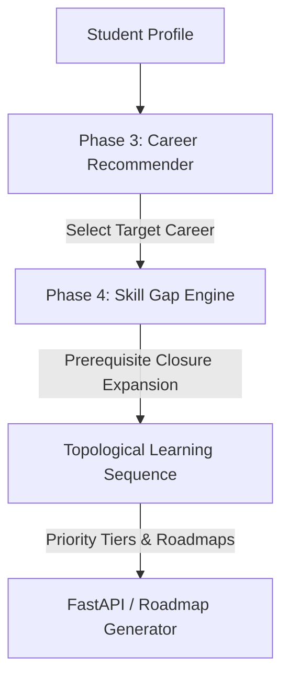

# Phase 4 — Skill Gap Intelligence Engine

## 1. Phase Objective
The objective of Phase 4 is to build the **Skill Gap Intelligence Engine** for RouteMaster. This engine answers: `"What skills does a student need to acquire to become qualified for a target career, and in what sequence should those skills be learned?"`
To achieve this, the engine:
- Normalizes student input skills.
- Pulls career requirements from the registries.
- Computes matching/missing gaps for both technical and soft skills.
- Integrates the Phase 2 NetworkX dependency graph to trace transitively missing prerequisites.
- Implements dependency-aware priority inheritance (foundations inherit target criticalities).
- Generates a topologically sorted roadmap of the learning path.

## 2. Position in Overall Architecture
The Skill Gap Engine bridges the gap between career recommendation (Phase 3) and personalized roadmap generation:



By resolving prerequisites and ordering them, SDEs can directly consume this output to map courses and projects to each ordered step of the student's roadmap.

## 3. Input Data
The engine consumes the processed registries from Phase 1 and the graph resolver from Phase 2:
- `data/processed/careers.json`: 122 careers.
- `data/processed/skills.json`: 8,908 canonical skills.
- `data/processed/career_skills.json`: 608 required technical skill mappings.
- `data/processed/career_transferable_skills.json`: 452 required soft skill mappings.
- `data/processed/skill_dependencies.json` & `skill_graph.json`: Prerequisite networks.

## 4. Pydantic Schema Contracts
We define stable, SDE-ready Pydantic request and response models in `src/gap_engine/schemas.py`:

### Request Contract (`SkillGapRequest`):
- `current_skills`: list of strings.
- `target_career`: string (canonical ID or Title).

### Response Contract (`SkillGapResponse`):
- `target_career_id`: canonical career ID.
- `target_career_title`: career title.
- `target_career_domain`: career domain.
- `technical_match_percentage`: float.
- `transferable_match_percentage`: float.
- `overall_readiness_score`: float ($0.7 \times \text{tech} + 0.3 \times \text{trans}$).
- `matched_technical_skills`: list of matched tech skill details.
- `missing_technical_skills`: list of directly missing required tech skill details.
- `matched_transferable_skills`: list of matched soft skills.
- `missing_transferable_skills`: list of missing soft skills.
- `prerequisite_gaps`: list of transitively missing prerequisite skills.
- `priority_gaps`: dict grouping all gaps into `Critical`, `High`, `Medium`, and `Low` lists.
- `learning_sequence`: ordered flat list of Pydantic steps for the learning path.

## 5. Priority Inheritance Logic
Directly required skills get priority weights based on database importance:
- `Critical` -> Critical priority
- `High` -> High priority
- `Medium` -> Medium priority

### Prerequisite Priority Inheritance Rule:
Prerequisite skills (which may not be directly listed in the career requirements but are required to learn them) inherit the maximum priority level among all downstream required skills in the gap set that they support:
$$Priority(P) = \max_{T \in Descendants(P) \cap Gaps} Priority(T)$$

For example, if Python is a prerequisite for Machine Learning (which is Critical) and Docker (which is High), Python is assigned a priority of **Critical** because it supports a critical target skill. This ensures that learners are guided to master key foundational blocks first.

## 6. Topological Sorting and Sequencing
The engine builds a directed subgraph of the required prerequisite network containing only the missing skills (direct and prerequisite gaps).
It then runs NetworkX's `topological_sort` algorithm to compute a linear ordering:
- If skill $A$ is a prerequisite for $B$, $A$ is guaranteed to come before $B$ in the sequence.
- Disconnected graph components (e.g. Frontend web skills vs. Machine Learning mathematics) are resolved into a single linear sequence preserving their independent constraints.
- Soft/transferable skills are appended at the end of the sequence as they are non-sequential.

## 7. JSON Output Example
An execution output is stored in [verify_gap.log](file:///C:/Users/Lenovo/.gemini/antigravity-ide/brain/88f07848-2a7b-4fc3-8890-4256ad515e2a/.system_generated/tasks/task-475.log) and visualized in the test logs.

## 8. Unit / Integration Tests
Pytest test suite is implemented in [`tests/test_gap_engine.py`](file:///d:/projects/HCL%20Amplified%20-%20Course%20Recommendation%20System/tests/test_gap_engine.py):
- **test_request_schema_validation**: Validates request models and catches bad parameter shapes.
- **test_gap_calculation_ai_engineer**: Evaluates gaps for AI Engineer when user only has Python. Checks matched and missing technical counts.
- **test_topological_sequence_ordering**: Assures that for every sequence step, all prerequisites are positioned earlier.
- **test_invalid_career_lookup**: Verifies that lookups on unknown careers fail with informative ValueErrors.
- **test_duplicate_aliases_normalization**: Verifies duplicate skills (ML, machine-learning, Machine Learning) merge into a single canonical target.

## 9. Reproducibility
To reproduce the Skill Gap Engine pipeline and execute the unit tests, run:
```bash
# 1. Install dependencies
pip install -r requirements.txt

# 2. Run tests
pytest tests/test_gap_engine.py
```

## 10. Handoff to Next Phases
Phase 5 (Skill Extraction & Normalization) and Phase 10 (Personalized Roadmap Generation) can import:
- Class `SkillGapEngine` from `src.gap_engine.gap_engine`.
- FastAPI model schemas `SkillGapRequest` and `SkillGapResponse` from `src.gap_engine.schemas`.
