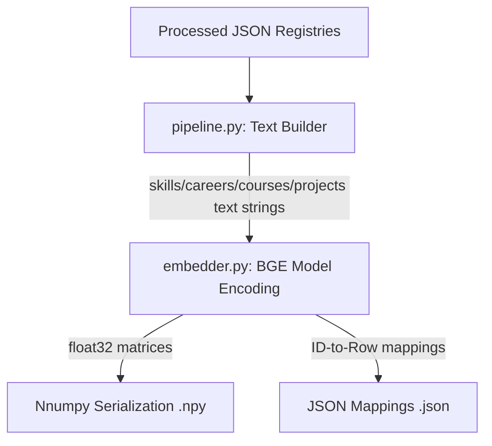

# Phase 5 — Semantic Representation & Embedding Intelligence

## 1. Phase Objective
The objective of Phase 5 is to implement a **Sentence Transformer–based semantic embedding pipeline** for RouteMaster. This pipeline:
- Establishes dense vector representations of all four core entities: Skills, Careers, Courses, and Projects.
- Supports future semantic retrieval, recommendation, and vector search operations (e.g., MongoDB Atlas Vector Search / Qdrant).
- Persists all embedding vectors and mappings deterministically onto disk.
- Retains full backward compatibility with existing modules (TF-IDF baselines, gap engines).

## 2. Architecture & Handoff Integration
The embedding pipeline processes raw text attributes into dense 384-dimensional floating-point vectors:



These generated artifacts are saved under `model/embeddings/` for easy loading by downstream recommendation services or batch database seeders.

## 3. Model Selection & Specifications
We use **`BAAI/bge-small-en-v1.5`** as our primary embedding model:
- **Dimensions**: 384 dimensions (lightweight, small memory footprint).
- **Size**: ~100MB on disk (ideal for local development and rapid CPU/GPU inference).
- **Normalization**: Enabled (`normalize_embeddings=True`). Since embeddings are unit-length normalized, the cosine similarity between two vectors simplifies to a fast, direct dot product:
  $$\text{Cosine Similarity}(\vec{a}, \vec{b}) = \vec{a} \cdot \vec{b}$$

## 4. Text Representation Templates
To extract high-quality semantics, we compile structured descriptive strings for each entity:

- **Skills**:
  `[Skill Name] | Category: [Skill Category] | Type: [Skill Type]`
- **Careers**:
  `[Career Title] | Domain: [Career Domain] | Description: [Career Description] | Technical Skills: [Required skill names, comma-separated] | Soft Skills: [Required soft skill names, comma-separated] | Interests: [RIASIC types and scores]`
- **Courses**:
  `[Course Name] | Difficulty: [Difficulty] | Provider: [Organization] | Description: [Course Description] | Skills: [Canonical skill names, comma-separated]`
- **Projects**:
  `[Project Name] | Domain: [Domain] | Difficulty: [Difficulty] | Description: [Description] | Tech Stack: [Stack, comma-separated] | Skills: [Canonical skill names, comma-separated]`

## 5. Persistence Format
To maintain maximum flexibility and database decoupling, outputs are stored in two files per entity type:
1. **Numpy File (`model/embeddings/[entity]_embeddings.npy`)**: A binary serialization of the numpy matrix of shape `[N, 384]`.
2. **Mapping File (`model/embeddings/[entity]_ids.json`)**: A key-value dictionary mapping the entity's unique ID to its row index inside the numpy matrix:
   ```json
   {
     "SK_00001": 0,
     "SK_00002": 1
   }
   ```

## 6. Generated Artifact Statistics
- **Skills**: Matrix of shape `(8908, 384)` with 8,908 indexed keys.
- **Careers**: Matrix of shape `(122, 384)` with 122 indexed keys.
- **Courses**: Matrix of shape `(3416, 384)` with 3,416 indexed keys.
- **Projects**: Matrix of shape `(251, 384)` with 251 indexed keys.

All files are located in [model/embeddings/](file:///d:/projects/HCL%20Amplified%20-%20Course%20Recommendation%20System/model/embeddings).

## 7. How Downstream Applications Can Consume the Embeddings
SDE and backend developers can easily load these embeddings for vector operations or seed them into MongoDB Atlas / Qdrant.

### Example Python Loading & Similarity Lookup:
```python
import numpy as np
import json

# 1. Load persisted assets
embeddings = np.load("model/embeddings/courses_embeddings.npy")
with open("model/embeddings/courses_ids.json", "r") as f:
    id_to_idx = json.load(f)

# 2. Lookup embedding by ID
idx = id_to_idx["CRS_0001"]
vec = embeddings[idx]  # Shape: (384,)
```

## 8. Automated Unit/Integration Tests
Pytest unit tests are implemented in [`tests/test_embeddings.py`](file:///d:/projects/HCL%20Amplified%20-%20Course%20Recommendation%20System/tests/test_embeddings.py):
- **test_embedder_initialization**: Validates dimension dimensions (384) and device fallback.
- **test_embedder_encoding**: Validates single-string encoding shapes and self-similarity unity values.
- **test_semantic_similarity_rankings**: Validates relative alignments (e.g. "Python programming language syntax" is semantically closer to "C++ software coding structure" than to "Corporate balance sheet audits").
- **test_pipeline_persistence_loading**: Verifies that numpy and mapping index files exist and have matching sizes.

## 9. Reproducibility
To regenerate the embeddings and run the tests, run:
```bash
# 1. Generate embeddings
python -m src.run_embedding_pipeline

# 2. Run tests
python -m pytest tests/test_embeddings.py
```
