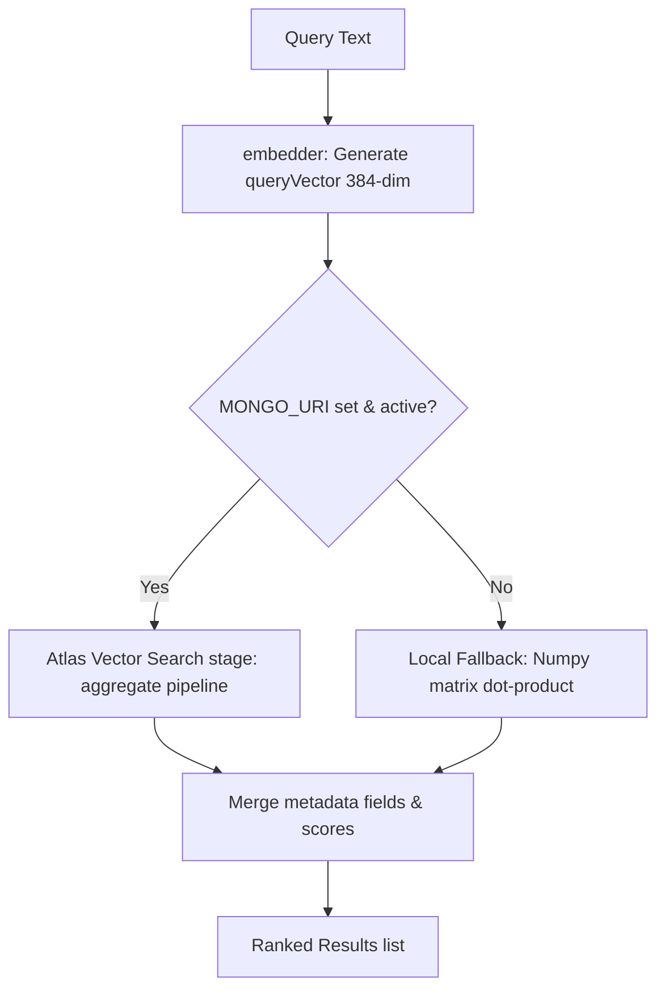

# Phase 6 — Semantic Retrieval & Vector Search

## 1. Phase Objective
The objective of Phase 6 is to build a **semantic retrieval system** using **MongoDB Atlas Vector Search** for the RouteMaster databases. This vector search layer:
- Normalizes search inputs and encodes queries dynamically using Phase 5 Sentence Transformer embeddings.
- Formulates valid MongoDB Atlas Vector Search `$vectorSearch` pipeline stages.
- Connects to a MongoDB Atlas cluster if `MONGO_URI` is present in the environment.
- Falls back to in-memory cosine similarity checks (using local numpy matrices and JSON metadata indices) if no connection exists.
- Exposes a CLI script to join canonical metadata records with their corresponding float32 embeddings and bulk seed MongoDB Atlas collections.
- Maintained 100% backward compatibility with previous phases.

## 2. Architecture & Aggregation Pipeline Stage
The retrieval orchestrator maps incoming natural language queries to vector database search operations:



### MongoDB Atlas Vector Aggregation Pipeline:
We execute the search via MongoDB's `$vectorSearch` pipeline stage on target collections (`skills`, `careers`, `courses`, `projects`):
```json
[
  {
    "$vectorSearch": {
      "index": "vector_index",
      "path": "embedding",
      "queryVector": [0.012, -0.054, ...],
      "numCandidates": 100,
      "limit": 5
    }
  },
  {
    "$project": {
      "embedding": 0,
      "score": { "$meta": "vectorSearchScore" }
    }
  }
]
```

## 3. MongoDB Atlas Indexing Requirements
To run the vector search query in MongoDB Atlas, SDEs must create a vector index on the target collections:
- **Index Name**: `vector_index`
- **JSON Configuration**:
  ```json
  {
    "fields": [
      {
        "type": "vector",
        "path": "embedding",
        "numDimensions": 384,
        "similarity": "cosine"
      }
    ]
  }
  ```

## 4. Local Cosine Fallback (Offline Mode)
To ensure the system works in development environments, local mock testing, and CI/CD pipelines without a live Atlas cluster, we implement a graceful fallback:
- Loads local numpy arrays (`skills_embeddings.npy`, etc.).
- Computes dot product between the query vector and the embedding matrix:
  $$\text{Similarities} = \mathbf{M}_{embeddings} \cdot \vec{q}$$
- Sorts similarity scores in descending order and matches indices back to the canonical JSON metadata records.
- Outputs identical schema structures as the production MongoDB results.

## 5. Seeding CLI
We provide a CLI utility at [`src/seed_vector_database.py`](file:///d:/projects/HCL%20Amplified%20-%20Course%20Recommendation%20System/src/seed_vector_database.py). SDEs can run this tool to seed their database collections:
```bash
python -m src.seed_vector_database --db-name routemaster
```
If `MONGO_URI` is not configured, SDEs can preview document generation and structures offline using the `--dry-run` flag:
```bash
python -m src.seed_vector_database --dry-run
```

## 6. Automated Unit/Integration Tests
Pytest unit tests are implemented in [`tests/test_vector_search.py`](file:///d:/projects/HCL%20Amplified%20-%20Course%20Recommendation%20System/tests/test_vector_search.py):
- **test_local_search_fallback_courses**: Verifies offline cosine matching results (e.g. searching "React" brings up frontend/react courses).
- **test_local_search_fallback_careers**: Verifies offline career alignments (e.g. searching "Deep learning" aligns to AI Engineer / Machine Learning Engineer).
- **test_mongodb_query_pipeline_construction**: Mocks the MongoClient connection and inspects the aggregate call arguments to confirm that `$vectorSearch` query options are structured correctly.
- **test_seeder_dry_run**: Verifies that the seeder reads metadata, merges vectors, and counts mapped records correctly.

## 7. Reproducibility
To verify the vector search module and run the tests, run:
```bash
# 1. Run seeder dry-run to preview database documents
python -m src.seed_vector_database --dry-run

# 2. Run unit tests
python -m pytest tests/test_vector_search.py
```
