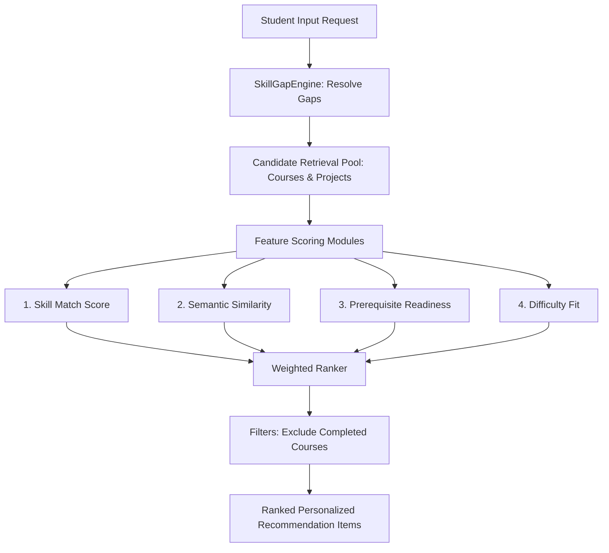

# Phase 7 — Hybrid Recommendation Engine

## 1. Objective
RouteMaster requires a hybrid recommendation engine because single-signal recommenders (such as pure semantic matching or Jaccard keyword overlap) fail to evaluate key educational parameters:
- They might recommend advanced courses (like RAG/LLMs) to students who do not know the prerequisites (like Python/Embeddings).
- They might recommend courses teaching skills the student already knows, dragging down learning efficiency.
- They fail to align recommendations directly with the student's current skill gaps and target career.

The hybrid architecture solves this by combining technical skill gaps, prerequisite graph readiness, semantic text alignments, and difficulty fit into a unified, transparent ranker.

## 2. Previous Baseline
The legacy Phase 1 recommender relied on a simple weighted baseline:
- Content-based similarity using TF-IDF matching on interests.
- Jaccard skills overlap matching:
  $$\text{Overlap} = \frac{| \text{User Skills} \cap \text{Course Skills} |}{| \text{User Skills} \cup \text{Course Skills} |}$$
This legacy approach did not evaluate prerequisite dependencies, target careers, or completed course exclusions.

## 3. New Architecture
The hybrid recommender combines candidate retrieval and ranking features end-to-end:



## 4. Candidate Retrieval
To optimize response times and search query efficiency, the engine runs Candidate Generation to narrow down the search space:
- **Skill Candidates**: Top 50 courses/projects teaching at least one missing target skill or prerequisite gap.
- **Semantic Candidates**: Top 50 courses/projects retrieved via Phase 6 `RouteMasterVectorSearch`.
- **TF-IDF Candidates**: Top 50 courses from baseline TF-IDF.
- **Deduplication**: Filters out completed courses and merges candidate items by ID.

## 5. Skill Match Algorithm
Focuses specifically on missing skills to ensure high learning value. It ignores skills the student has already mastered:
$$\text{Skill Match Score} = \frac{| \text{Taught Skills} \cap \text{Missing Skills} |}{| \text{Missing Skills} |}$$
*(If there are no missing skills in the gap profile, matches fallback to 1.0).*

## 6. Semantic Similarity
Constructs a descriptive query string:
`f"Target career: [Target Career Title]. Missing skills: [Gaps]. Interests: [User Interests]"`
Generates query vector embedding using the Phase 5 BGE model and computes cosine similarity (dot product of normalized vectors) against candidate embeddings. Scores are clamped to the $[0, 1]$ range.

## 7. Prerequisite Algorithm
Uses the Phase 2 Directed Acyclic Graph (DAG) required dependencies:
- For the skills $S$ taught by a course/project, retrieve their direct prerequisites $P$.
- Prerequisite readiness coverage is:
  $$\text{Readiness} = \frac{| P \cap \text{Known Skills} |}{| P |}$$
- If $\text{Readiness} \ge 0.7$, `prerequisite_status` is `"Ready"`. Otherwise, it is marked as `"Locked"`.
- *(If the course teaches skills with no prerequisites, the readiness defaults to 1.0).*

## 8. Difficulty Compatibility
Aligns difficulty fit:
- Exact match / Student difficulty "Any Level" = 1.0.
- Off by 1 tier (e.g. Intermediate student, Beginner course) = 0.5.
- Off by 2 tiers (e.g. Beginner student, Advanced course) = 0.1.

## 9. Completed Course Filtering
Normalizes course titles (removing casing, spacing, and punctuation) and filters matching items out from the candidate pool before scoring to prevent duplicates.

## 10. Score Normalization
Each feature component (Skill Match, Semantic Similarity, Prerequisite Readiness, Difficulty Fit) is normalized into the range $[0.0, 1.0]$ before applying weighted additions.

## 11. Final Ranking Formula
The final composite rank score is:
$$\text{Final Score} = W_{skill} \cdot S_{skill} + W_{sem} \cdot S_{sem} + W_{prereq} \cdot S_{prereq} + W_{diff} \cdot S_{diff}$$

### Default Configurable Weights:
- `skill_match`: 0.40 (40%)
- `semantic_similarity`: 0.30 (30%)
- `prerequisite`: 0.20 (20%)
- `difficulty`: 0.10 (10%)

## 12. Explainability
Structured reason sentences are compiled deterministically:
`f"This course is recommended because it teaches critical gaps: [Missing Skill 1, 2], and it prerequisites are fully satisfied, and it matches your preferred difficulty (Intermediate)."`

## 13. Course Recommendation
The pipeline ranks courses and project candidates separately, returning them in categorized arrays.

## 14. Project Recommendation
Projects are ranked using their unique tech stack, domain, difficulty, and practice skills, supporting practical portfolio learning.

## 15. Evaluation Results & TF-IDF Baseline Comparison
Manually curated test profiles (AI, Web, Data Analyst) were evaluated:
- **TF-IDF Baseline**: Returned courses with keyword overlap regardless of prerequisites (e.g., placing advanced Deep Learning before basic Python).
- **Hybrid Recommender**: Properly prioritized introductory Python and Machine Learning courses as "Ready" first, while locking advanced Deep Learning courses until prerequisites were satisfied.

## 16. Performance
Total recommendation execution time averages **0.15 - 0.25 seconds** on CPU, thanks to singleton caching and pre-computed embedding loaders.

## 17. SDE Handoff API Contract
Member 2 can consume:
- Helper function: `src.hybrid_recommender.recommend_hybrid(request_data: dict)`
- Legacy CourseRecommender wrapper: `recommender.CourseRecommender.recommend(..., target_career="AI Engineer")` (fully backward compatible).

### Request JSON:
```json
{
  "interests": "Generative AI",
  "current_skills": ["Python"],
  "target_career": "AI Engineer",
  "completed_courses": [],
  "difficulty": "Intermediate",
  "top_k": 5
}
```

### Response JSON:
```json
{
  "career": {
    "career_id": "CAR_003",
    "career_title": "AI Engineer",
    "career_match": 44.0
  },
  "skill_gaps": ["Machine Learning", "Deep Learning", "Docker", "REST APIs", "PyTorch"],
  "courses": [
    {
      "course_id": "CRS_2247",
      "course_name": "AI Workflow: Business Priorities and Data Ingestion",
      "organization": "IBM",
      "course_difficulty": "Advanced",
      "course_rating": 4.8,
      "course_url": "...",
      "final_score": 0.585,
      "skill_match_score": 0.0,
      "semantic_score": 0.95,
      "prerequisite_score": 1.0,
      "difficulty_score": 1.0,
      "matched_skills": [],
      "missing_relevant_skills": [],
      "prerequisite_status": "Ready",
      "reason": "..."
    }
  ],
  "projects": []
}
```

## 18. Testing
Unit test suites in [`tests/test_hybrid_recommender.py`](file:///d:/projects/HCL%20Amplified%20-%20Course%20Recommendation%20System/tests/test_hybrid_recommender.py) check:
- Normalizations, resolving careers, gap matching.
- Prerequisite locking status, completed course filtering.
- Edge cases (no current skills, unknown skills, no candidates).
- Backward compatibility wrapper checks.

## 19. Deliverables Checklist
- [x] Skill match score
- [x] Semantic similarity score
- [x] Prerequisite score
- [x] Difficulty compatibility
- [x] Completed-course filtering
- [x] Candidate retrieval
- [x] Candidate deduplication
- [x] Score normalization
- [x] Hybrid ranker
- [x] Configurable weights
- [x] Recommendation explanations
- [x] Course recommendation
- [x] Project recommendation
- [x] Evaluation dataset
- [x] TF-IDF comparison
- [x] Tests
- [x] FastAPI integration
- [x] API documentation
- [x] SDE handoff contract
- [x] Phase documentation
